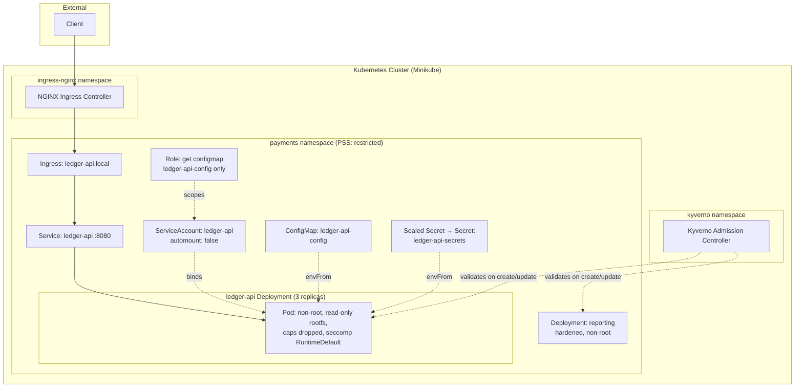

# Task 1 — Deploy & Harden the Workload

This document covers the deployment and hardening of `ledger-api` and its neighbour
service (`reporting`) in a local Kubernetes cluster (Minikube), turning the original
insecure starter manifests into a production-grade, PCI-DSS-conscious configuration.

## Objective

Deploy `ledger-api` from an insecure baseline (root container, plaintext secrets,
default ServiceAccount, no network/admission controls) to a hardened state suitable
for a PCI DSS-scoped, cardholder-adjacent service, and prove — with live evidence,
not just static YAML — that the hardening actually holds under test.

## Repository Structure

```
deploy/
├── configmap.yaml              # Non-sensitive app config
├── deployment-hardened.yaml    # Hardened ledger-api Deployment (deployed)
├── ingress.yaml                # NGINX Ingress routing to ledger-api
├── namespace.yaml               # payments namespace, PSS "restricted" enforced
├── neighbour-hardened.yaml     # Hardened reporting Deployment (deployed)
├── rbac.yaml                   # Least-privilege Role/RoleBinding for ledger-api SA
├── sealed-secret.yaml          # Encrypted STRIPE_API_KEY / DB_PASSWORD
├── service.yaml                # ClusterIP Service for ledger-api
├── serviceaccount.yaml         # Dedicated ledger-api ServiceAccount
└── insecure-baseline/          # Original vulnerable manifests — NEVER deployed
    ├── deployment.yaml         # Kept only as a negative test case for admission control
    └── neighbour.yaml

policies/
├── disallow-root-and-latest-tag.yaml   # Kyverno: reject root containers + :latest tag
├── require-signed-images.yaml          # Kyverno: reject unsigned images (see note below)
├── rbac-personas.yaml                  # Bonus: developer/operator/admin Roles
└── test-cases/
    └── test-latest-tag.yaml            # Isolated negative test for the :latest rule

app/
├── app.py               # Hardened application code (safe YAML load, SSRF guard)
├── Dockerfile            # Non-root, digest-pinned, minimal image
└── requirements.txt      # Updated, non-EOL dependency versions
```

> ⚠️ **`deploy/insecure-baseline/` note:** these two files are the original,
> intentionally vulnerable manifests from the starter repository — plaintext
> secrets, no securityContext, default ServiceAccount. They are kept unmodified
> and **never deployed as the real workload**. Their sole purpose is to serve as
> negative test cases proving Pod Security Standards and Kyverno correctly reject
> them (see Verification Evidence below).

## Architecture



## Security Findings in the Original Application

Before hardening the infrastructure, two real code-level vulnerabilities were
identified and fixed in `app/app.py`, since infrastructure hardening alone
wouldn't address them:

| Endpoint | Issue | Fix |
|---|---|---|
| `POST /import` | `yaml.load(request.data)` with no `Loader` — arbitrary code execution via crafted YAML (`!!python/object/apply` tags), compounded by `PyYAML==5.1` sitting in the CVE-2020-1747 vulnerability window | Changed to `yaml.safe_load(request.data)` |
| `GET /fetch?url=` | No validation on the target URL — classic SSRF, could reach internal services, cloud metadata endpoints (`169.254.169.254`), or `localhost` | Added `is_safe_url()` allowlist check (blocks non-global IPs, `localhost`, metadata IP) + `allow_redirects=False` to prevent bypass via redirect |

Dependencies were also bumped off long-EOL versions (Flask 0.12.2 → 3.0.3,
PyYAML 5.1 → 6.0.1, requests 2.19.1 → 2.32.3, etc.) since the original pins were
from 2018 and carried multiple known CVEs independent of the two issues above.

## Design Decisions

**Dockerfile.** Base image pinned to a specific digest (`python:3.12-slim@sha256:...`)
rather than a mutable tag, non-root numeric UID (`10001`) baked into the image so
Kubernetes' `runAsUser` reliably matches, `chown` applied before the image is
finalized since `readOnlyRootFilesystem: true` means nothing can be written at
runtime regardless of ownership.

**ServiceAccount / RBAC.** `app.py` makes zero Kubernetes API calls at runtime —
it only reads `os.environ`. This means the dedicated ServiceAccount exists purely
for *identity* (used later for NetworkPolicy/Istio scoping in Task 3), not for API
access, so `automountServiceAccountToken: false` is set and the bound Role grants
the absolute minimum: `get` on one specifically named ConfigMap, nothing else. No
`list`, no `watch`, no wildcard resource names.

**Secrets.** Sealed Secrets was chosen over SOPS+age or External Secrets because
it requires no external dependency (KMS, cloud secret store) — fits the assignment's
"runs fully local" constraint while still fully removing plaintext from git. The
controller's private key never leaves the cluster; `deploy/sealed-secret.yaml` is
safe to commit since only that controller can decrypt it.

**`readOnlyRootFilesystem` + `/tmp` emptyDir.** Setting the container filesystem
read-only meant Python/Flask's incidental writes (e.g. to `/tmp`) needed an
explicit writable volume. An `emptyDir` mounted at `/tmp` provides scratch space
without compromising the read-only guarantee anywhere else in the container.

**`reporting` neighbour — no liveness/readiness probes.** This container runs
`sleep infinity` with no listening port and no health-checkable process state; it
exists as a placeholder representing a service that would consume `ledger-api`.
HTTP/TCP probes don't apply since there's nothing to probe, and an `exec` probe
merely checking the sleep process is alive would only duplicate what Kubernetes'
own restart policy already guarantees — a fake probe just to satisfy a checklist
adds no real signal. In a reporting service with actual HTTP endpoints, probes
would be added identically to `ledger-api`'s.

**Kyverno policy scope: `resources.kinds: [Pod]`.** Kyverno's `validate` rules
match on Pod specs; Kyverno automatically generates equivalent rules for
Deployments/ReplicaSets/Jobs via its "autogen" feature (visible in the evidence
below as `autogen-disallow-root`), so a single policy authored against `Pod`
correctly covers Deployment-level admission too.

**RBAC personas — `operator` can read but not delete Secrets.** In a PCI-scoped
payments namespace, on-call operators need visibility into what's configured
during an incident, but Secret mutation is deliberately reserved for `admin` only
— narrower blast radius if an operator credential is compromised.

## Kyverno Policy: Unsigned Image Rejection — Deferred

`policies/require-signed-images.yaml` is written and ready but not yet activated
or tested in this section. It requires a real Cosign-signed image to verify
against, which doesn't exist until Task 2's CI/CD pipeline signs one. Activating
and demonstrating this policy (signed image passes, unsigned image is rejected)
is completed in Task 2's README once the signing pipeline is live.

## Verification Evidence

All evidence below is real terminal output captured while building this task —
no fabricated screenshots.

### 1. Pod Security Standards rejects the insecure baseline

Applying `deploy/insecure-baseline/deployment.yaml` (root container, no
securityContext) into the `payments` namespace, which enforces
`pod-security.kubernetes.io/enforce: restricted`:

```
Warning: would violate PodSecurity "restricted:latest": allowPrivilegeEscalation != false
(container "ledger-api" must set securityContext.allowPrivilegeEscalation=false),
unrestricted capabilities (container "ledger-api" must set securityContext.capabilities.drop=["ALL"]),
runAsNonRoot != true (pod or container "ledger-api" must set securityContext.runAsNonRoot=true),
seccompProfile (pod or container "ledger-api" must set securityContext.seccompProfile.type
to "RuntimeDefault" or "Localhost")
deployment.apps/ledger-api created
```

The Deployment object is created (Deployments aren't Pods, so PSS doesn't block
them directly), but the underlying ReplicaSet fails to spawn any pods:

```
Replicas:       0 current / 3 desired
Pods Status:    0 Running / 0 Waiting / 0 Succeeded / 0 Failed
Conditions:
  Type             Status  Reason
  ----             ------  ------
  ReplicaFailure   True    FailedCreate
Events:
  Warning  FailedCreate  ...  Error creating: pods "ledger-api-...-4x8tr" is forbidden:
  violates PodSecurity "restricted:latest": ... [repeated for every replica attempt]
```

Zero pods ever came up. This confirms PSS enforcement is real, not just a warning.

### 2. Kyverno rejects root containers (background scan)

With `disallow-root-and-latest-tag` applied, re-applying the insecure baseline
produces Kyverno `PolicyViolation` events across Pod, ReplicaSet, and Deployment
objects:

```
Warning   PolicyViolation   replicaset/ledger-api-686c7fcb45   policy disallow-root-and-latest-tag/autogen-disallow-root
fail: validation error: Running as root is not allowed. Set securityContext.runAsNonRoot=true
at the pod or container level. rule autogen-disallow-root[0] failed at path
/spec/template/spec/securityContext/runAsNonRoot/ rule autogen-disallow-root[1] failed at path
/spec/template/spec/containers/0/securityContext/
```

### 3. Kyverno hard-blocks root containers at admission time

A subsequent apply of the same insecure baseline was denied outright by the
admission webhook (not just flagged after the fact):

```
Error from server: error when applying patch: ...
admission webhook "validate.kyverno.svc-fail" denied the request:
resource Deployment/payments/ledger-api was blocked due to the following policies
disallow-root-and-latest-tag:
  autogen-disallow-root: 'validation error: Running as root is not allowed.
    Set securityContext.runAsNonRoot=true at the pod or container level.
    rule autogen-disallow-root[0] failed at path /spec/template/spec/securityContext/runAsNonRoot/
    rule autogen-disallow-root[1] failed at path /spec/template/spec/containers/0/securityContext/'
```

The hardened Deployment's live state (`deployment.apps/ledger-api unchanged`)
was correctly left untouched — Kyverno protected the real workload from being
overwritten by the insecure spec.

### 4. Kyverno rejects `:latest` tag (isolated test)

A minimal test pod (`policies/test-cases/test-latest-tag.yaml`) that satisfies
every other `restricted` PSS requirement but uses `nginx:latest`:

```
Error from server: admission webhook "validate.kyverno.svc-fail" denied the request:
resource Pod/payments/test-latest-tag was blocked due to the following policies
disallow-root-and-latest-tag:
  disallow-latest-tag: 'validation failure: Using '':latest'' tag or an untagged image
    is not allowed. Pin to a specific version or digest.'
```

### 5. Sealed Secrets round-trip

```bash
$ kubectl get secret ledger-api-secrets -n payments -o jsonpath='{.data.STRIPE_API_KEY}' | base64 -d
sk_live_9f3a2b7c1e4d8REDACTED
$ kubectl get secret ledger-api-secrets -n payments -o jsonpath='{.data.DB_PASSWORD}' | base64 -d
P@ssw0rd123
```

Values decrypted correctly from `deploy/sealed-secret.yaml` (safe to commit —
only the in-cluster controller can decrypt it), confirming the encrypt → commit →
decrypt round-trip works. The original plaintext values are assumed compromised
since they were committed to git in the starter repo, and would be rotated in a
real remediation before this reaches production.

### 6. Hardened pods pass their own probes cleanly

```
NAME                          READY   STATUS    RESTARTS   AGE
ledger-api-696cf47d6d-b2kmc   1/1     Running   0          72m
ledger-api-696cf47d6d-whqpz   1/1     Running   0          72m
ledger-api-696cf47d6d-zz7vv   1/1     Running   0          72m
reporting-846788bcfb-zcnjt    1/1     Running   0          47m
```

`Conditions: Ready: True, ContainersReady: True` on every pod — full
securityContext restrictions, Sealed Secret + ConfigMap injection, and probes
all working simultaneously, no restarts.

### 7. Application-level fixes verified live, in-cluster

```bash
$ curl http://localhost:8080/health
{"status":"ok"}

$ curl "http://localhost:8080/fetch?url=http://169.254.169.254"
{"error":"URL not allowed"}                    # SSRF blocked (was previously a 500 crash)

$ curl "http://localhost:8080/fetch?url=https://example.com"
{"body":"...", "status_code":200}              # legitimate fetch still works

$ curl -X POST http://localhost:8080/import -H "Content-Type: text/plain" -d 'key: value'
{"loaded":"{'key': 'value'}"}                  # safe YAML parse (was previously RCE-prone)
```

### 8. Ingress routes traffic end-to-end

```bash
$ curl -H "Host: ledger-api.local" http://127.0.0.1/health
{"status":"ok"}
$ curl -H "Host: ledger-api.local" http://127.0.0.1/transactions
{"transactions":[...]}
```

Confirms the full path: NGINX Ingress Controller → Service → hardened pods.

### 9. RBAC personas — least privilege confirmed

```bash
$ kubectl auth can-i delete secrets --as=test-operator --as-group=payments-operators -n payments
no
$ kubectl auth can-i get secrets --as=test-operator --as-group=payments-operators -n payments
yes
$ kubectl auth can-i create rolebindings --as=test-admin --as-group=payments-admins -n payments
yes
```

Operators can read Secrets (needed for incident response) but not delete them;
admins can manage RBAC within the namespace. Matches the intended least-privilege
design.

### 10. `ledger-api`'s own ServiceAccount — zero unnecessary permissions

```bash
$ kubectl auth can-i list secrets --as=system:serviceaccount:payments:ledger-api -n payments
no
```

Confirms the application's own identity has no ability to enumerate cluster
secrets, consistent with `app.py` making zero Kubernetes API calls.

## Setup & Deployment

```bash
# Cluster
minikube start --driver=docker --cpus=2 --memory=4000

# Namespace with Pod Security Standards
kubectl apply -f deploy/namespace.yaml

# ServiceAccount, RBAC
kubectl apply -f deploy/serviceaccount.yaml
kubectl apply -f deploy/rbac.yaml

# Config and secrets
kubectl apply -f deploy/configmap.yaml
kubectl apply -f deploy/sealed-secret.yaml   # requires Sealed Secrets controller installed first

# Build and load the hardened image (local dev path — see note below for GHCR)
cd app && docker build -t ledger-api:hardened . && cd ..
minikube image load ledger-api:hardened

# Workloads
kubectl apply -f deploy/deployment-hardened.yaml
kubectl apply -f deploy/neighbour-hardened.yaml
kubectl apply -f deploy/service.yaml

# Ingress (requires: minikube addons enable ingress)
kubectl apply -f deploy/ingress.yaml

# Kyverno admission policies
kubectl apply --server-side -f https://github.com/kyverno/kyverno/releases/download/v1.13.2/install.yaml
kubectl apply -f policies/disallow-root-and-latest-tag.yaml
kubectl apply -f policies/rbac-personas.yaml
```

## Validation

```bash
kubectl get pods -n payments                          # expect 4 pods, all 1/1 Running
kubectl get sealedsecret,secret,configmap -n payments
kubectl auth can-i list secrets --as=system:serviceaccount:payments:ledger-api -n payments   # expect: no
kubectl port-forward -n payments deployment/ledger-api 8080:8080
curl http://localhost:8080/health                      # expect: {"status":"ok"}
```

## Cleanup

```bash
kubectl delete namespace payments
kubectl delete namespace kyverno
kubectl delete namespace kube-system --dry-run=client   # do NOT actually delete kube-system;
                                                          # instead remove just the sealed-secrets
                                                          # controller deployment/service if needed
minikube delete
```

## Troubleshooting Notes (encountered during this build)

- **Minikube cert errors on Windows/Docker driver** (`certificate signed by unknown
  authority`) — resolved with a full `minikube delete --all --purge` plus manual
  removal of `~/.minikube`, then a clean `minikube start`. A partial/interrupted
  previous cluster left a stale CA that a normal restart didn't clear.
- **Stale image cache in Minikube** — `minikube image load` with an unchanged tag
  name didn't always replace an old image, even with `--overwrite=true` (the
  default). Fix: `minikube ssh -- docker rmi -f <image>` to force-remove the
  stale copy before reloading. Diagnosed by comparing `IMAGE ID` between
  `docker images` (host) and `minikube ssh -- docker images` (node).
- **Kyverno's large CRDs exceeding the 262144-byte annotation limit** under
  `kubectl apply` (client-side apply) — resolved with
  `kubectl apply --server-side`, which doesn't rely on the
  `last-applied-configuration` annotation. Mixing client-side and server-side
  apply on the same objects caused field-ownership conflicts and a
  `CrashLoopBackOff` on the admission controller; fixed with a full delete and
  clean server-side-only reinstall.
- **Kyverno pattern anchors (`=(...)`) are optional-if-present, not
  mandatory** — an early version of the `disallow-root` rule used
  `=(securityContext): =(runAsNonRoot): "true"`, which trivially passes when the
  field is absent entirely (exactly the case for the insecure baseline). Fixed
  by removing the `=()` anchor to make the field mandatory.
- **`kubectl auth can-i --as-group` requires `--as`** — Kubernetes rejects group
  impersonation without an accompanying (even placeholder) username.

## References

- [Kubernetes Pod Security Standards](https://kubernetes.io/docs/concepts/security/pod-security-standards/)
- [Kyverno Policies](https://kyverno.io/policies/)
- [Bitnami Sealed Secrets](https://github.com/bitnami-labs/sealed-secrets)
- [OWASP SSRF Prevention Cheat Sheet](https://cheatsheetseries.owasp.org/cheatsheets/Server_Side_Request_Forgery_Prevention_Cheat_Sheet.html)
- [PyYAML CVE-2020-1747](https://nvd.nist.gov/vuln/detail/CVE-2020-1747)
