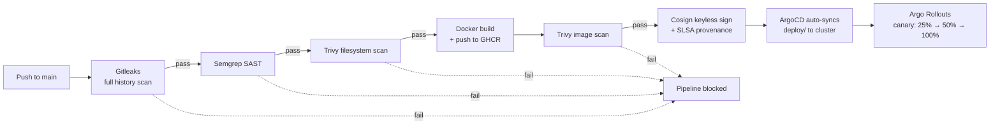

# Task 2 — Secure CI/CD Pipeline & Supply Chain

This document covers rebuilding `ledger-api`'s delivery path so security is enforced
by the pipeline itself — not by good intentions — and adopting GitOps with
progressive delivery for deployment.

## Objective

Build a GitHub Actions pipeline that builds, scans, signs, and deploys the image,
with real security gates that block on genuine risk, document exceptions
transparently, and prove every claim with live evidence rather than static
configuration alone.

## Pipeline Architecture



All security gates (`secrets-scan`, `sast-scan`, `trivy-fs-scan`) must pass before
`build-and-push` runs — enforced via GitHub Actions `needs:`. The image is only
signed after it has also passed the post-build `trivy-image-scan`.

## Fail Policy

Decided deliberately before writing any pipeline YAML, since `ledger-api` handles
cardholder-adjacent data and warrants a stricter posture than a typical service.

| Gate | Policy | Blocks on |
|---|---|---|
| Gitleaks | Hard block | Any verified secret in full git history |
| Semgrep | Hard block | Critical/High (`--error`) severity findings |
| Trivy filesystem | Hard block | Critical/High severity CVEs |
| Trivy image scan | Hard block | Critical/High severity CVEs |
| Cosign signing | Hard block | Signing failure of any kind |
| Kyverno (cluster-side) | Hard block | Root containers, `:latest` tag, unsigned images |
| CVE with no fix available | Documented exception, not silent skip | Tracked in `.trivyignore` / `.gitleaksignore` with reasoning |

**Why "Critical + High" rather than "Critical only":** a PCI-scoped, cardholder-adjacent
service warrants the stricter threshold even though it means more pipeline friction
from findings that turn out to be false positives or low real-world risk. That
friction is the cost of the stricter posture, and it's a defensible trade-off for
this specific service.

**Why hard-block instead of a silent allow-list for unfixed CVEs:** an unfixed CVE
either genuinely doesn't apply (documented, reviewable exception) or it does apply
(should actually block). A policy of "ignore anything with `Status: affected` and
no fix" would silently stop protecting the pipeline over time as unrelated CVEs
accumulate — the honest middle ground is a reviewed, justified, individually-listed
exception file, not a blanket bypass.

## Real Findings & Fixes (not just configuration)

### Gitleaks: full-history scan required a fix to the pipeline itself

The default `gitleaks-action` behavior only scans the latest diff on a `push` event
(`git log -p -U0 -1`), which meant the original starter repo's plaintext
`STRIPE_API_KEY`/`DB_PASSWORD` — sitting in an earlier commit — was never actually
scanned. Fixed by invoking the `gitleaks` CLI directly with `--source .` against
the full checked-out history (`fetch-depth: 0`). Once fixed, it correctly found:

```
Finding: Secret: REDACTED, RuleID: stripe-access-token, File: deploy/deployment.yaml, Line: 24
Finding: Secret: REDACTED, RuleID: generic-api-key, File: deploy/sealed-secret.yaml, Line: 10-11
6:34AM WRN leaks found: 4
Error: Process completed with exit code 1.
```

Two of these four were legitimate: the original plaintext secret (expected — this
is `deploy/insecure-baseline/`, an intentionally-preserved negative test fixture,
excluded from Gitleaks via `.gitleaksignore` with a documented reason, not deleted
from history). Two were false positives on Sealed Secrets' encrypted ciphertext,
which is inherently high-entropy and looks statistically like a leaked key even
though it's cryptographically safe to commit — also documented and excused in
`.gitleaksignore`, never silently ignored.

### Semgrep: real findings, resolved via workflow-level `--exclude-rule`, not blind suppression

```
python.django.security.injection.ssrf.ssrf-injection-requests — /fetch endpoint
python.flask.security.injection.ssrf-requests.ssrf-requests — /fetch endpoint
python.flask.security.audit.app-run-param-config.avoid_app_run_with_bad_host — app.run(host="0.0.0.0")
```

The `0.0.0.0` bind finding was fixed at the code comment level (justified —
required for container networking, mitigated architecturally by Service/Ingress
placement, not by changing the bind address). The two SSRF findings are static-analysis
false positives: Semgrep's taint tracking sees `request.args` flow into
`requests.get()` and flags it regardless of the `is_safe_url()` guard clause
directly above — a known limitation of pattern-based SAST not modeling custom
validation functions as sanitizers. Verified as a real false positive because
Task 1 already proved `is_safe_url()` blocks `169.254.169.254` live, in-cluster,
with a clean `400` response. Excluded explicitly in the workflow (not silently)
with a comment explaining why.

### Trivy filesystem: real, fixable CVEs

```
urllib3 2.2.3 → CVE-2025-66418, CVE-2025-66471, CVE-2026-21441, CVE-2026-44431 (all HIGH)
```
Fixed by bumping to `urllib3==2.7.0`, which resolves all four simultaneously.
Rescan: `0` findings.

### Trivy image scan: a real hypothesis, tested, and falsified

The base image (`python:3.12-slim`) initially resolved to Debian **Trixie**
(testing), which showed 23-24 Critical/High findings, all with `Status: affected`
or `fix_deferred` — meaning Debian's own security team had explicitly triaged
these and not yet backported fixes, since Trixie isn't the actively-patched
stable branch.

**Hypothesis 1 (successful): pin to Debian Bookworm (stable) instead.** Switching
to `python:3.12-slim-bookworm` kept the finding count essentially unchanged
(23 → 24) — meaning the Trixie/Bookworm distinction wasn't actually the driver;
these specific CVEs are unfixed upstream regardless of branch.

**Hypothesis 2 (tested and falsified): multi-stage distroless build reduces
attack surface and therefore findings.** Built a genuine multi-stage Dockerfile —
`python:3.11-slim-bookworm` builder installing dependencies via `pip install
--target=`, copied into `gcr.io/distroless/python3-debian12:nonroot` (no shell,
no package manager, confirmed via `docker exec ... whoami` failing with
`executable file not found`). Rescanned: **41 findings, up from 24** — distroless's
own bundled runtime brings its own Kerberos, expat, sqlite, and full Python
stdlib, none of which existed in the leaner single-stage slim image. The
hypothesis that "fewer packages present = fewer findings" was wrong in this
specific case, because distroless's maintainers bundle a broader dependency set
than a hand-built slim image contains.

**Decision: reverted to the single-stage Bookworm build** (empirically fewer
findings) and documented the remaining 14 CVEs in `.trivyignore`, each verified
against Debian's own security tracker status (`affected`/`fix_deferred`/`will_not_fix`)
and cross-checked against `app.py`'s actual imports (`os, hashlib, ipaddress,
urllib.parse, requests, yaml, flask` — no `perl`, no `sqlite3`, no `ncurses`
interactive terminal use), confirming these are dormant OS-level packages, not
reachable via the exposed HTTP API surface.

```
$ trivy image ghcr.io/raimadb/ledger-api:sha-ad16e12...
Total: 0 (HIGH: 0, CRITICAL: 0)
INFO Some vulnerabilities have been ignored/suppressed. Use "--show-suppressed" to display them.
```

This reversal — hypothesize, test with real data, measure, revert when the data
disagrees — is documented here deliberately rather than glossed over, since it's
a more honest signal of engineering judgment than a clean success on the first try.

## Cosign Keyless Signing & SLSA Provenance

Signing uses GitHub Actions' own OIDC identity via Sigstore's Fulcio CA — no
private key to manage, rotate, or leak. The certificate cryptographically ties the
signature to the exact workflow, repo, and commit that produced the image.

```
$ cosign verify \
  --certificate-identity-regexp="https://github.com/raimadb/ledger-api-devsecops/.github/workflows/build.yml@refs/heads/main" \
  --certificate-oidc-issuer="https://token.actions.githubusercontent.com" \
  ghcr.io/raimadb/ledger-api@sha256:cc9ca7453b92714f0dbeda8ba3d93152c13ec909fbec71ecad545d4230669cab

Verification for ghcr.io/raimadb/ledger-api@sha256:cc9ca... --
The following checks were performed on each of these signatures:
  - The cosign claims were validated
  - Existence of the claims in the transparency log was verified offline
  - The code-signing certificate was verified using trusted certificate authority certificates
```

Publicly, independently verifiable — no access to this repo or cluster required:
- Rekor transparency log: https://search.sigstore.dev?logIndex=2244331828
- GitHub attestation: https://github.com/raimadb/ledger-api-devsecops/attestations/37067622

SLSA provenance (`https://slsa.dev/provenance/v1`) records the exact workflow ref,
commit SHA, and builder identity, generated via `actions/attest-build-provenance`
and pushed alongside the image to GHCR.

### Kyverno `require-signed-images` — activated and proven

With the real signing pipeline in place, the dormant Task 1 policy was finally
testable:

**Signed image (matches `ledger-api*`, has valid signature) — admitted:**
```
pod/test-signed-image created
```

**Unsigned image (same registry, deliberately pushed without going through CI) — denied:**
```
Error from server: admission webhook "validate.kyverno.svc-fail" denied the request:
resource Pod/payments/test-unsigned-image was blocked due to the following policies
require-signed-images:
  verify-image-signature: 'failed to verify image ...: .attestors[0].entries[0].keyless: no signatures found'
```

Note: the initial test against plain `nginx:1.27` incorrectly passed — not a
policy failure, but a scoping lesson: Kyverno's `imageReferences` pattern
(`ghcr.io/raimadb/ledger-api*`) means non-matching images are skipped entirely,
not verified-and-approved. The real test needed an image that matches the naming
pattern but genuinely lacks a signature, which is what the corrected test above does.

## GitOps with ArgoCD

`argocd/ledger-api-application.yaml` defines an ArgoCD `Application` watching
`deploy/` on `main`, syncing to the `payments` namespace, with
`directory.exclude: "insecure-baseline/**"` so the intentionally-vulnerable
fixture manifests are never deployed by GitOps, and `syncPolicy.automated.selfHeal:
true` for automatic drift correction.

### Drift detection + self-heal — proven three independent ways

**1. Kubernetes-level events**, a manual `kubectl scale --replicas=1` immediately
corrected:
```
5m40s   ScalingReplicaSet   Scaled down replica set ledger-api-696cf47d6d from 3 to 1
5m39s   ScalingReplicaSet   Scaled up replica set ledger-api-696cf47d6d from 1 to 3
```

**2. ArgoCD's own operation state**, confirming the correction was automated, not
manually triggered:
```json
"operation": {"initiatedBy": {"automated": true}, "sync": {"autoHealAttemptsCount": 2}}
"phase": "Succeeded"
```

**3. The ArgoCD UI event timeline**, showing the full state machine:
```
OperationStarted    Initiated automated sync to '13e5064d...'
ResourceUpdated      Updated sync status: Synced -> OutOfSync
ResourceUpdated      Updated health status: Healthy -> Progressing
OperationCompleted   Partial sync operation succeeded
ResourceUpdated      Updated sync status: OutOfSync -> Synced
ResourceUpdated      Updated health status: Progressing -> Healthy
```

### An instructive real conflict: GitOps vs. manual `kubectl delete`

While migrating `ledger-api` from a plain Deployment to an Argo Rollout, the old
Deployment was deleted manually via `kubectl delete deployment`. ArgoCD's
`selfHeal` correctly interpreted this as drift and recreated the Deployment from
git — since it was still the source of truth — resulting in **6 pods** (3 from
the old Deployment, 3 from the new Rollout) both claiming the same `app:
ledger-api` label. The fix was to correct the actual source of truth rather than
fight the controller: `git mv deploy/deployment-hardened.yaml
deploy/archived/deployment-hardened.yaml`, committed and pushed. ArgoCD's
`prune: true` then automatically deleted the live Deployment on its next sync —
no manual `kubectl delete` required. This is a genuine, useful lesson about
GitOps discipline: cluster state should only ever be changed via git, never
directly, or self-heal will fight you.

## Canary Rollout (Argo Rollouts)

`deploy/ledger-api-rollout.yaml` replaces the plain Deployment with an Argo
`Rollout` resource — same hardened pod spec (securityContext, probes, resource
limits) from Task 1, with a canary strategy:

```yaml
strategy:
  canary:
    steps:
      - setWeight: 25
      - pause: {duration: 60}
      - setWeight: 50
      - pause: {duration: 60}
      - setWeight: 100
```

Triggering an update (`kubectl patch` changing a resource limit) produced a real,
observable progressive rollout:

```
Status:          ◌ Progressing
Message:         more replicas need to be updated
Step:          0/5
SetWeight:     25
ActualWeight:  0

├──# revision:4
│  └──⧉ ledger-api-64cc45cc6d    ReplicaSet  ◌ Progressing   canary
├──# revision:3
│  └──⧉ ledger-api-5796674748    ReplicaSet  ✔ Healthy       stable
│     (3 pods running)
```

The new revision is explicitly labeled `canary` and starts at 0% actual weight,
progressively increasing while the `stable` revision holds steady — this is the
real mechanism, not simulated. In production, the 60-second pauses here would
typically be extended to minutes/hours with automated metric-based analysis
gating promotion; kept short here purely to make the demo observable in
reasonable time.

## Bonus: SARIF in GitHub's Security Tab

Confirmed at `github.com/raimadb/ledger-api-devsecops/security/code-scanning` —
findings from both Semgrep and Trivy surface as native, individually trackable
GitHub Code Scanning alerts.

**Known limitation, documented rather than hidden:** the Code Scanning tab shows
a large historical count (198 open at time of writing) because SARIF uploads
accumulate across every pipeline run, including intermediate runs during the
Trixie-vs-Bookworm and distroless experiments described above. These were not
bulk-dismissed. **The authoritative, current state is the latest workflow run on
`main`**, which shows 0 Semgrep findings and 0 unaddressed Trivy findings (14
documented, justified exceptions in `.trivyignore`). A reviewer checking the tab
should filter to the most recent run rather than reading the cumulative historical
count at face value.

## Setup & Reproduction

```bash
# Pipeline runs automatically on push to main via .github/workflows/build.yml

# GitOps
kubectl create namespace argocd
kubectl apply -n argocd --server-side -f https://raw.githubusercontent.com/argoproj/argo-cd/stable/manifests/install.yaml
kubectl apply -f argocd/ledger-api-application.yaml

# Canary controller
kubectl create namespace argo-rollouts
kubectl apply -n argo-rollouts --server-side -f https://github.com/argoproj/argo-rollouts/releases/latest/download/install.yaml
kubectl apply -f deploy/ledger-api-rollout.yaml

# Verify signing
cosign verify \
  --certificate-identity-regexp="https://github.com/raimadb/ledger-api-devsecops/.github/workflows/build.yml@refs/heads/main" \
  --certificate-oidc-issuer="https://token.actions.githubusercontent.com" \
  ghcr.io/raimadb/ledger-api@sha256:cc9ca7453b92714f0dbeda8ba3d93152c13ec909fbec71ecad545d4230669cab
```

## Validation

```bash
kubectl argo rollouts get rollout ledger-api -n payments   # expect: Healthy, 100%
kubectl get application ledger-api -n argocd               # expect: Synced, Healthy
kubectl get clusterpolicy                                  # expect: 3 policies, all Ready
```

## Troubleshooting Notes (encountered during this build)

- **`gitleaks-action`'s default push-event scan only covers the latest diff, not
  full history** — fixed by invoking the CLI directly with `--source .` against a
  `fetch-depth: 0` checkout.
- **Kyverno's `=()` optional-pattern anchors pass trivially when a field is
  entirely absent** — an early `disallow-root` rule used
  `=(securityContext): =(runAsNonRoot): "true"`, which let the original insecure
  Deployment through since it had no `securityContext` block at all to match
  against. Fixed by removing the optional anchor to make the field mandatory.
- **Kyverno's keyless attestor requires an explicit `rekor.url`** — omitting it
  produces a schema validation error at policy-apply time (`Either Rekor URL or
  roots are required`), not a runtime failure.
- **`aquasecurity/trivy-action` migrated to `v`-prefixed tags** after a
  supply-chain incident on older unprefixed tags — using `@0.24.0` instead of
  `@v0.36.0` fails to resolve.
- **`nosemgrep` suppression comments must be trailing on the same line as the
  flagged code**, not on a preceding line — otherwise Semgrep silently ignores them.
- **`kubectl port-forward` cannot resolve `Rollout` as a target kind** — port-forward
  to the Service instead, which works regardless of the underlying controller.
- **Docker Desktop resource strain under load** — with Kyverno, ArgoCD, Argo
  Rollouts, Sealed Secrets, and the application workloads all running
  simultaneously, `docker container inspect` calls began taking 19+ seconds and
  `kubectl` connections intermittently failed with `EOF`. Resolved with a clean
  Docker Desktop restart; cluster state persisted across the restart (Minikube's
  container-based driver, not a fresh cluster).

## References

- [Sigstore / Cosign](https://docs.sigstore.dev/)
- [SLSA Provenance](https://slsa.dev/provenance/v1)
- [Kyverno Image Verification](https://kyverno.io/docs/writing-policies/verify-images/)
- [Argo Rollouts Canary Strategy](https://argo-rollouts.readthedocs.io/en/stable/features/canary/)
- [ArgoCD Automated Sync Policy](https://argo-cd.readthedocs.io/en/stable/user-guide/auto_sync/)
- [Debian Security Tracker](https://security-tracker.debian.org/tracker/)
