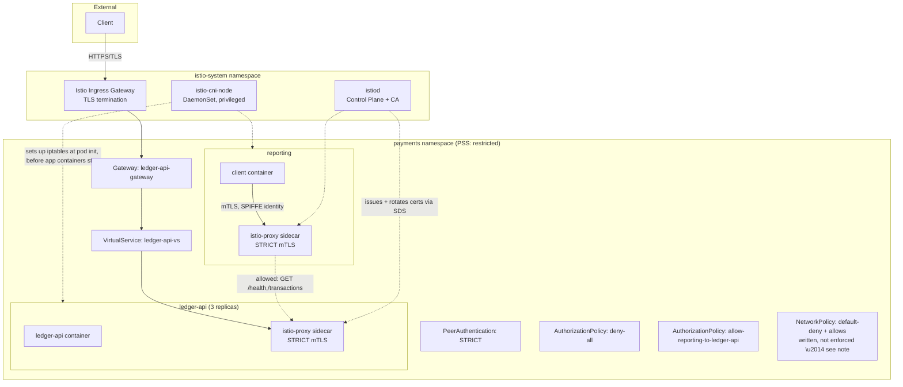

# Task 3 — Service Mesh & Zero-Trust (Istio)

This document covers bringing `ledger-api` and its `reporting` neighbour into an
Istio service mesh, enforcing identity-based zero-trust between them, and layering
network-level controls underneath.

## Objective

Build a service mesh enforcing mTLS and identity-based authorization between
`ledger-api` and `reporting`, prove every control with live evidence, and document
the real engineering trade-offs encountered — including a genuine architectural
conflict between Istio's classic sidecar model and Kubernetes' Restricted Pod
Security Standard, discovered and resolved during this work.

## Architecture



## Setup

```bash
# Install Istio with the CNI plugin — required for PSS "restricted" compatibility (see below)
istioctl install --set profile=demo --set components.cni.enabled=true --set values.cni.privileged=true -y

# Enable sidecar injection for the payments namespace
kubectl label namespace payments istio-injection=enabled

# Restart workloads to pick up injection
kubectl scale rollout ledger-api -n payments --replicas=0
kubectl scale rollout ledger-api -n payments --replicas=3
kubectl rollout restart deployment/reporting -n payments
```

## A Real Architectural Conflict: Istio Sidecars vs. Pod Security Standards

The first sidecar injection attempt failed outright:

```
Error creating: pods "reporting-58d4cf9f6d-5n9tc" is forbidden: violates PodSecurity
"restricted:latest": unrestricted capabilities (container "istio-init" must not
include "NET_ADMIN", "NET_RAW" in securityContext.capabilities.add), runAsNonRoot
!= true (container "istio-init" must not set securityContext.runAsNonRoot=false),
runAsUser=0 (container "istio-init" must not set runAsUser=0)
```

**Root cause:** Istio's classic sidecar injection model uses a per-pod `istio-init`
container that configures iptables rules to redirect traffic through the Envoy
proxy — this genuinely requires `NET_ADMIN`/`NET_RAW` capabilities and root, which
is fundamentally incompatible with a `restricted` PSS namespace (which Task 1
deliberately enforces for this exact reason: no elevated capabilities, no root).

**Fix:** Istio's **CNI plugin** solves this by moving iptables setup out of each
pod entirely and into a privileged, node-level DaemonSet (`istio-cni-node`,
running in `istio-system`, never in `payments`). Traffic redirection happens
before any pod containers start, at the CNI layer — application pods in `payments`
never need elevated capabilities themselves. This is Istio's own documented
solution to this exact problem, not a workaround invented for this assignment.

After enabling CNI (`--set components.cni.enabled=true --set values.cni.privileged=true`),
both workloads came up cleanly with sidecars:

```
NAME                          READY   STATUS    RESTARTS   AGE
ledger-api-5796674748-cnpcb   2/2     Running   0          2m35s
ledger-api-5796674748-gm6nx   2/2     Running   0          2m35s
ledger-api-5796674748-r8zr7   2/2     Running   0          2m35s
reporting-58d4cf9f6d-s6jq8    2/2     Running   0          11m
```

This is documented here in full because it's a genuine trade-off worth
understanding, not a mistake to hide: teams adopting Istio in a
security-hardened, PSS-`restricted` cluster need the CNI plugin from day one, not
as an afterthought.

## STRICT mTLS

```yaml
apiVersion: security.istio.io/v1
kind: PeerAuthentication
metadata:
  name: default
  namespace: payments
spec:
  mtls:
    mode: STRICT
```

Deliberately scoped to the `payments` namespace rather than mesh-wide — this
namespace is the PCI-relevant boundary (see CDE mapping below), and scoping the
policy explicitly here is a defensible, intentional decision rather than a
blanket mesh-wide default.

**Verified directly:**
```
$ istioctl x describe pod ledger-api-5796674748-cnpcb -n payments
Effective PeerAuthentication:
   Workload mTLS mode: STRICT
Applied PeerAuthentication:
   default.payments
```

**Proof a plaintext (non-mTLS) request is refused** — a pod outside the mesh
(no sidecar, `default` namespace) attempting plain HTTP:
```
$ kubectl run plaintext-test --image=curlimages/curl:8.8.0 -n default --rm -it \
  --restart=Never -- curl -v http://ledger-api.payments.svc.cluster.local:8080/health --max-time 5

* Connected to ledger-api.payments.svc.cluster.local (10.103.147.185) port 8080
> GET /health HTTP/1.1
* Request completely sent off
* Recv failure: Connection reset by peer
curl: (56) Recv failure: Connection reset by peer
```

TCP connection succeeds (the sidecar accepts it), but the moment a plaintext
HTTP request is sent, the sidecar resets the connection — it will not complete
a non-mTLS application-layer exchange. This is `STRICT` mode working correctly,
not a misconfiguration.

## Identity-Based Authorization (SPIFFE, not IP)

**Default-deny for the namespace:**
```yaml
apiVersion: security.istio.io/v1
kind: AuthorizationPolicy
metadata:
  name: deny-all
  namespace: payments
spec: {}
```

**Explicit allow, keyed on cryptographic workload identity:**
```yaml
apiVersion: security.istio.io/v1
kind: AuthorizationPolicy
metadata:
  name: allow-reporting-to-ledger-api
  namespace: payments
spec:
  selector:
    matchLabels:
      app: ledger-api
  action: ALLOW
  rules:
    - from:
        - source:
            principals: ["cluster.local/ns/payments/sa/reporting"]
      to:
        - operation:
            methods: ["GET"]
            paths: ["/health", "/transactions"]
```

`principals` checks the **SPIFFE identity** encoded in the mTLS certificate
presented during the handshake — derived from the calling pod's ServiceAccount,
not its IP address. This is real zero-trust: identity survives pod
rescheduling, IP changes, and node moves, which IP-based rules never could.
Scoped further to specific HTTP methods/paths — `reporting` cannot reach
`/import` or `/fetch` even though it's an authenticated, trusted mesh member,
reflecting least-privilege at the authorization layer, not just network reachability.

### Three proven test cases

| Test | Caller identity | Endpoint | Result |
|---|---|---|---|
| 1 | `reporting` SA (allowed) | `GET /health` (in allow-list) | `200` |
| 2 | `reporting` SA (allowed) | `POST /import` (not in allow-list) | `403` |
| 3 | `default` SA (no matching principal) | `GET /health` | `403` |

```
# Test 1
$ kubectl exec -n payments deploy/reporting -c client -- curl -s -o /dev/null -w "%{http_code}\n" http://ledger-api:8080/health
200

# Test 2 — same identity, different path
$ kubectl exec -n payments deploy/reporting -c client -- curl -s -o /dev/null -w "%{http_code}\n" -X POST http://ledger-api:8080/import -d 'key: value'
403

# Test 3 — unauthorized identity, same allowed path
$ kubectl exec -n payments unauthorized-test -- curl -sv http://ledger-api:8080/health --max-time 5
< HTTP/1.1 403 Forbidden
< server: envoy
RBAC: access denied
```

Test 3 in particular shows the request reaching Envoy (`server: envoy`,
full HTTP exchange completed) and being explicitly rejected by RBAC — proof
this is application-layer identity checking, not a network-level drop.

## Kubernetes NetworkPolicy — Written, Applied, Honestly Documented as Unenforced

`istio/networkpolicy-default-deny.yaml` and `istio/networkpolicy-allow-rules.yaml`
define a default-deny-all posture with explicit allows for DNS, Istio
control-plane communication, and `reporting → ledger-api:8080`. Both apply
successfully to the cluster.

**However**, live testing showed these policies are not actually enforced:
the same unauthorized-identity request that Istio correctly blocked at L7
(Test 3 above) reached `ledger-api` at the TCP/HTTP level completely
unimpeded — only Envoy's RBAC stopped it, not the NetworkPolicy layer.

**Root cause, confirmed:**
```bash
$ kubectl get pods -n kube-system | grep -iE "calico|cilium|weave|antrea"
# (no output)
$ minikube addons list | grep -i cni
# (no output)
```

Minikube's default CNI does not implement NetworkPolicy enforcement — the
Kubernetes API accepts and stores these objects regardless of whether the
underlying CNI acts on them, and no NetworkPolicy-capable CNI (Calico, Cilium,
etc.) is present on this cluster.

**Why not fixed by enabling Calico:** by this point in the assessment, the
cluster was already under significant resource strain — Istio's control plane
and sidecars had required scaling Kyverno, ArgoCD, Argo Rollouts, and Sealed
Secrets down to zero just to fit within a 2 CPU / 4GB Minikube allocation.
Adding Calico risked destabilizing several days of accumulated working state
for a control that Istio's AuthorizationPolicy already substantively covers at
a higher layer. This was a deliberate scope/risk trade-off, not an oversight.

**What NetworkPolicy would add on a properly-equipped cluster (EKS, GKE, or
Minikube with `--cni=calico`):** genuine L3/L4 defense-in-depth *underneath*
Istio — stopping raw TCP connection attempts before they ever reach the HTTP
layer Istio inspects. This matters for threats Istio's L7 policies can't see:
a compromised workload attempting protocol-level attacks, port scanning, or
any traffic that never speaks HTTP at all. Istio's AuthorizationPolicy and
Kubernetes NetworkPolicy are complementary, not redundant — this cluster
currently only has the L7 layer proven live.

## Certificate Issuance, Rotation, and Trust Root

**Issuance:** each workload's `istio-proxy` sidecar requests a certificate from
its local Istio agent via SDS (Secret Discovery Service) over a Unix domain
socket. The agent forwards the request to `istiod`'s built-in CA, which issues
an X.509 certificate encoding the workload's SPIFFE identity
(`spiffe://cluster.local/ns/payments/sa/ledger-api`) — derived from the pod's
namespace and ServiceAccount, the exact string `AuthorizationPolicy` checks
against `principals`.

**Rotation — confirmed live on this cluster:**
```
$ istioctl proxy-config secret ledger-api-5796674748-cnpcb.payments
RESOURCE NAME   TYPE         STATUS   VALID CERT   NOT AFTER               NOT BEFORE
default         Cert Chain   ACTIVE   true         2026-08-04T05:34:56Z    2026-08-03T05:32:56Z
ROOTCA          CA           ACTIVE   true         2036-07-26T14:53:40Z    2026-07-29T14:53:40Z
```

The workload certificate has a **24-hour lifetime**, matching Istio's default.
The Istio agent automatically requests a replacement at 80% of the lifetime
elapsed — fully transparent to the running application, no restart or
downtime.

**Trust root:** `istiod` (pod `istiod-798fc84754-9vwm8`) holds the cluster's
root CA — self-signed, generated automatically at install, **10-year validity**
shown above. Every workload certificate chains back to this single root, which
is what makes the mTLS handshake meaningful: `ledger-api`'s sidecar validates a
peer's certificate against this root, confirming both authenticity and the
SPIFFE identity string presented.

**Production note:** this self-signed root is appropriate for a local
assessment cluster but would not be appropriate for a real PCI-scoped
production deployment. In production, this root would typically be replaced
with an intermediate CA chained to an externally-governed root — via `cacerts`
secret injection or integration with HashiCorp Vault / cert-manager's
`istio-csr` — so certificate issuance is auditable against an organization's
existing PKI rather than a cluster-generated root with no external oversight.

## Bonus: PCI DSS Cardholder Data Environment (CDE) Scope Mapping

| PCI DSS Requirement | Mesh Control Implementing It |
|---|---|
| Req 1: Network segmentation between CDE and non-CDE systems | NetworkPolicy default-deny (written, see limitation above) + AuthorizationPolicy default-deny, both scoped to `payments` — no other namespace can reach `ledger-api` without an explicit allow |
| Req 4: Strong cryptography for cardholder data in transit | STRICT mTLS — every byte between mesh workloads in `payments` encrypted, proven live above |
| Req 7: Restrict access by business need-to-know | AuthorizationPolicy scoped per-path per-identity — `reporting` can read `/health`/`/transactions`, explicitly denied `/import` |
| Req 8: Unique ID for each person/system with access | SPIFFE identity gives every workload a unique, cryptographically-verifiable identity — no shared credentials, no IP-based trust |
| Req 10: Track and monitor all access to CDE resources | Envoy sidecars generate access logs for every request; in production this would feed a SIEM |

**Explicitly out of CDE-necessary scope:** `reporting` is denied access to
`/import`/`/fetch` — the higher-risk endpoints — even though it's an
authenticated, trusted mesh member. This reflects the PCI principle that CDE
access should be minimized even among already-trusted internal systems, not
just enforced at the network perimeter.

## Bonus: Istio Ingress Gateway with TLS Termination

```yaml
apiVersion: networking.istio.io/v1
kind: Gateway
metadata:
  name: ledger-api-gateway
  namespace: payments
spec:
  selector:
    istio: ingressgateway
  servers:
    - port: {number: 443, name: https, protocol: HTTPS}
      tls: {mode: SIMPLE, credentialName: ledger-api-tls-cert}
      hosts: ["ledger-api.local"]
```

A self-signed certificate was generated for this local demo
(`CN=ledger-api.local`) and stored as a TLS Secret in `istio-system`. In
production this would be a certificate from a real CA, not self-signed —
documented here as a deliberate local-demo simplification.

**Proven working via direct TLS handshake inspection** (curl's Windows/schannel
backend produced a misleading generic error; `openssl s_client` gives the
authoritative result):
```
$ openssl s_client -connect localhost:9443 -servername ledger-api.local
subject=CN=ledger-api.local, O=ledger-api-devsecops
issuer=CN=ledger-api.local, O=ledger-api-devsecops
New, TLSv1.3, Cipher is TLS_AES_256_GCM_SHA384
Verify return code: 18 (self-signed certificate)
```

TLS 1.3 handshake completes successfully, correct certificate served, `Verify
return code: 18 (self-signed certificate)` is the *expected* outcome for a
self-signed cert (not an error) — confirms the gateway is correctly performing
TLS termination.

## Bonus: Canary Release

Not re-implemented at the Istio VirtualService/DestinationRule layer for this
task — canary delivery is already fully implemented and proven via **Argo
Rollouts** in Task 2, using the same hardened `ledger-api` pod spec from Task 1
(securityContext, probes, resource limits unchanged). Given this cluster's
resource constraints, duplicating canary capability at a second layer (Istio
traffic-splitting) was judged lower priority than the mesh security work above
— full evidence is reproduced here rather than just cross-referenced, so this
document stands on its own.

```yaml
# deploy/ledger-api-rollout.yaml (excerpt)
strategy:
  canary:
    steps:
      - setWeight: 25
      - pause: {duration: 60}
      - setWeight: 50
      - pause: {duration: 60}
      - setWeight: 100
```

**Live progressive rollout, triggered by a spec change:**
```
$ kubectl patch rollout ledger-api -n payments --type='json' -p='[{"op": "replace", "path": "/spec/template/spec/containers/0/resources/limits/memory", "value": "270Mi"}]'
$ kubectl argo rollouts get rollout ledger-api -n payments --watch

Name:            ledger-api
Status:          ◌ Progressing
Message:         more replicas need to be updated
Strategy:        Canary
  Step:          0/5
  SetWeight:     25
  ActualWeight:  0

NAME                                    KIND        STATUS         INFO
⟳ ledger-api                            Rollout     ◌ Progressing
├──# revision:4
│  └──⧉ ledger-api-64cc45cc6d           ReplicaSet  ◌ Progressing  canary
├──# revision:3
│  └──⧉ ledger-api-5796674748           ReplicaSet  ✔ Healthy      stable
│     ├──□ ledger-api-5796674748-c9wmk  Pod         ✔ Running      ready:1/1
│     ├──□ ledger-api-5796674748-lz69j  Pod         ✔ Running      ready:1/1
│     └──□ ledger-api-5796674748-p87l6  Pod         ✔ Running      ready:1/1
```

The new revision is explicitly labeled `canary` and starts at `SetWeight: 25`,
`ActualWeight: 0` — actively ramping up — while the `stable` revision holds its
3 healthy pods steady. After both 60-second pauses complete, the rollout
converges back to `Healthy` / `Step: 5/5` / `SetWeight: 100`, with the old
revision scaled down and the new one now `stable`:

```
Name:            ledger-api
Status:          ✔ Healthy
Strategy:        Canary
  Step:          5/5
  SetWeight:     100
  ActualWeight:  100
Replicas:
  Desired:       3
  Current:       3
  Updated:       3
  Ready:         3
  Available:     3
```

This is a real, observable progressive delivery mechanism — not simulated —
distinct from and complementary to Istio's traffic management capabilities. In
production, the 60-second pauses here would typically be extended to
minutes/hours with automated metric-based analysis gating each promotion step
(Argo Rollouts supports this via `AnalysisTemplate` resources querying
Prometheus/Datadog); kept short here purely to make the demo observable within
a reasonable timeframe. Full narrative, including the GitOps-vs-manual-`kubectl
delete` conflict encountered while migrating from a plain Deployment to this
Rollout, is in Task 2's README under "Canary Rollout (Argo Rollouts)."

## Validation

```bash
kubectl get pods -n payments                                    # expect 2/2 on all pods
istioctl x describe pod <pod> -n payments                       # expect: Workload mTLS mode: STRICT
kubectl get authorizationpolicy -n payments                     # expect: deny-all, allow-reporting-to-ledger-api
kubectl get peerauthentication -n payments                      # expect: default (STRICT)
kubectl get gateway,virtualservice -n payments                  # expect: ledger-api-gateway, ledger-api-vs
```

## Cleanup

```bash
kubectl delete -f istio/
kubectl label namespace payments istio-injection-
istioctl uninstall --purge -y
kubectl delete namespace istio-system
```

## Troubleshooting Notes

- **Istio classic sidecar injection is incompatible with PSS `restricted`** —
  requires the CNI plugin (`components.cni.enabled=true`) to move privileged
  network setup to a node-level DaemonSet instead of a per-pod init container.
- **Minikube cluster resource exhaustion** — installing Istio's control plane
  and sidecars on top of Kyverno + ArgoCD + Argo Rollouts + Sealed Secrets on a
  2 CPU/4GB allocation caused repeated Docker Desktop strain (cgroup errors,
  `EOF` connection failures). Resolved by temporarily scaling non-essential
  controllers to zero rather than resizing the cluster (which would have
  required deletion and full state loss, since Minikube cannot resize an
  existing cluster in place).
- **`istioctl authn tls-check` is deprecated** in current Istio versions — use
  `istioctl x describe pod` instead.
- **Argo Rollouts requires its controller running to reconcile pod count** —
  unlike a plain Deployment, deleting Rollout-managed pods while the Argo
  Rollouts controller is scaled to zero leaves them permanently gone until the
  controller is restored.
- **`curlimages/curl`'s `curl_user` is non-numeric** — `runAsNonRoot: true`
  alone can't verify it; requires explicit `runAsUser: 100` (same issue
  encountered with the `reporting` container in Task 1).
- **`kubectl port-forward` and Windows schannel TLS quirks** — curl's
  Windows-native TLS backend produced a misleading generic handshake failure
  against a working gateway; `openssl s_client` gave the authoritative,
  correct result.
- **Minikube's default CNI does not enforce NetworkPolicy** — confirmed via
  absence of Calico/Cilium/Weave/Antrea; policies are syntactically valid and
  would work on a properly-equipped cluster.

## References

- [Istio CNI Plugin](https://istio.io/latest/docs/setup/additional-setup/cni/)
- [Istio PeerAuthentication](https://istio.io/latest/docs/reference/config/security/peer_authentication/)
- [Istio AuthorizationPolicy](https://istio.io/latest/docs/reference/config/security/authorization-policy/)
- [SPIFFE](https://spiffe.io/)
- [Kubernetes NetworkPolicy](https://kubernetes.io/docs/concepts/services-networking/network-policies/)
- [PCI DSS Requirements](https://www.pcisecuritystandards.org/)
